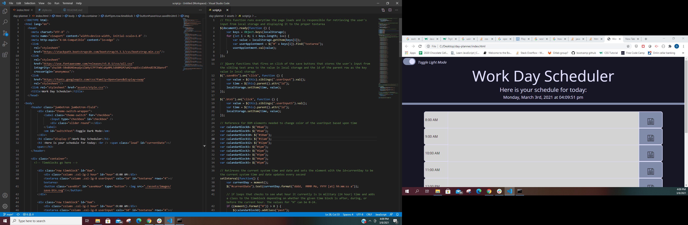

# day-planner

This program is a work day planner that allows the user to store whatever information they wish to in the various text areas that correspond to a given block of time(8AM throguh 5PM). This can be used to scheudle the days activities, meetings, appointments, and engagments that the user has that day. The time blocks are color coded to allow for a quick viewing to see what activities are in the past(gray), present(red), or future(green) for the user. This project makes use of jQuery, moment.js, CSS bootstrap, and local storage.

### Usage

To use the day planner the user must input information into the text area corresponding to a given time block. To save the information to the timeblock the user must click the save button that has an image of a floppy disc in it. To delete a given time block's information the user must delete the information in question using the mouse and keyboard and then click the save button again. There is also a dark mode/light mose toggle switch that allows the user to pick a visual theme. The user's current theme is saved to local storage and used when the page is reloaded.   

### Installation 

Installation: There is no instillation for this program as it is a singular webpage. If you would like to access the website visit: 
https://gpphelps.github.io/day-planner/

### Contributing 

If you would like to contribute in any way to this project please feel free to post an issue to the Github repository and I will address it as quickly as possible.

### Features
moment.js is utilized to display the current system time in the header of the webpage, and for the color coding of the time blocks. 
jQuery is used to make the dynamic save buttons that do not need an event listener to function, as well as for the if loops that determine the color of the time blocks at any given time.
CSS bootstrap is used to make the html elements format identically and have a sleek/professional look. 
Dark mode/light mode toggle switch is employed to give the user a choice about the webpage's color scheme. This information is stored in local storage and retireved when the page loads.
Local storage is also employed to store the user' input in the timeblocks and is retrieved through the use of a jQuery function that runs everytime the page loads.

### Credits

License: 2021 Gene Phelps II